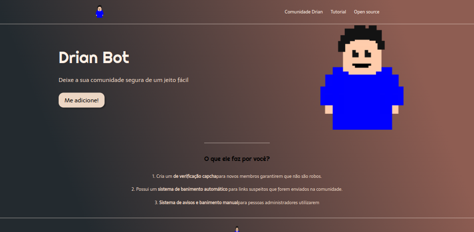

# Landing Page com HTMl e CSS 
 
## Table of contents

- [Overview](#overview)
  - [Screenshot](#screenshot)
- [My process](#my-process)
  - [Built with](#built-with)
  - [What I learned](#what-i-learned)
  - [Useful resources](#useful-resources)
- [Author](#author)

## Overview

### Screenshot

## My process

### Built with

- Semantic HTML5 markup
- CSS custom properties
- Flexbox

### Useful resources

- [Video Landing Page](https://www.youtube.com/watch?v=llF6vD-RljE&t=1230s) - Este projeto foi um dos meus primeiros contatos com códigos, achei bem divertido e bem bonito o resultado. No próprio, ela usou uma metodologia bem legal, enquanto ela codava ela ia realizando breves explicações, mas com uma linguagem bem didática.

## Author

- Linkedin - [Adriano Escarabote](https://www.linkedin.com/in/adriano-escarabote-944b02233/)
- instagram - [@ogdrian](https://www.instagram.com/ogdrian/)